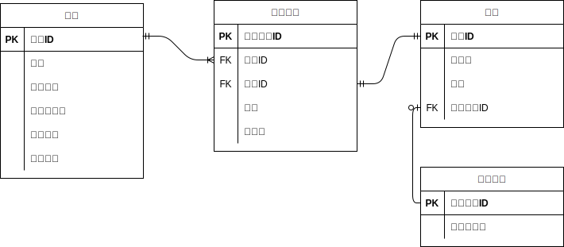
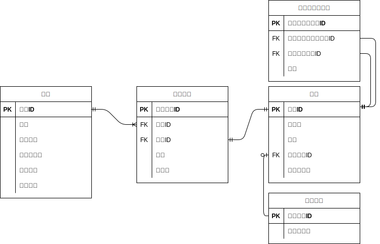
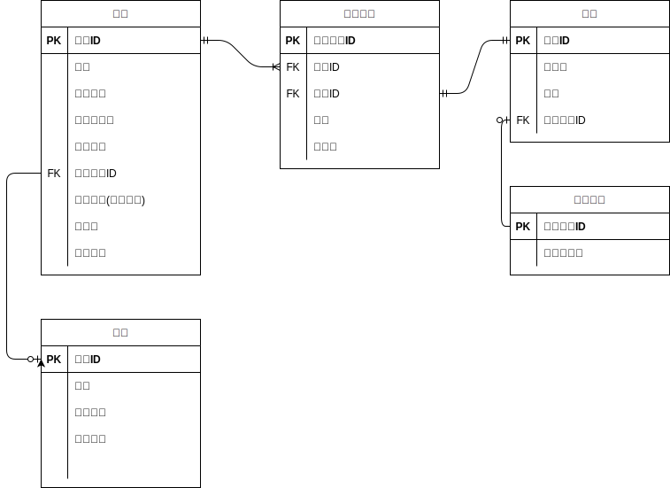

## 課題１

- 商品テーブルでセットメニューとお好み寿司とそれぞれの金額を管理しておく
- 合計金額は注文テーブルで保持しておく

## 課題2

### シャリの大小
商品テーブルにシャリの大小を管理するカラムを追加する

### セットメニューの寿司ネタ
- 商品テーブルにセットメニュー商品かどうかの区分カラムを追加する
- セットメニューテーブルを追加し、寿司ネタの構成を管理する
- セットメニューの注文の場合、セットメニューテーブルを結合して寿司ネタの個数をカウントする

## 課題3
### 仕様変更1
顧客が会員登録済みかを判定し、会員の場合は会計が5%オフになる

#### 回答
会員テーブル作成し、会員の場合は注文テーブルに外部キーを持たせる
アプリ側で値引額を計算し、値引き前の金額と値引額とトータルの金額を注文テーブルに保持する

### 仕様変更2
キャンペーンを開催するので、期間限定で特定の寿司ネタの金額を変更する
#### 回答
商品テーブルにキャンペーンフラグや値引額のカラムを持たせておく
フラグの更新などは定期バッチで行う
