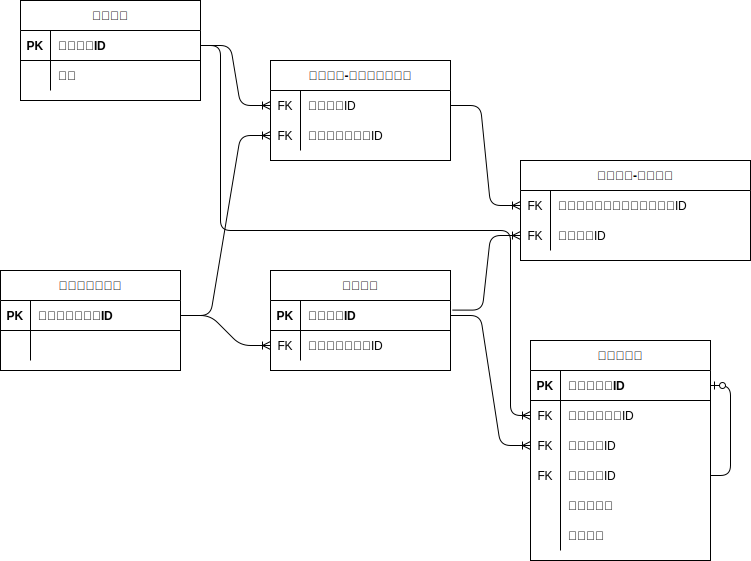
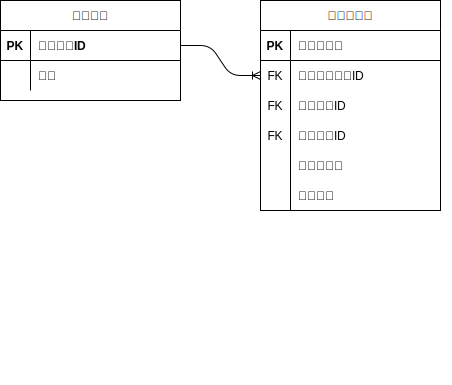

## 課題１

### メッセージ・スレッド
- メッセージテーブルを作成
- スレッドIDカラム(=スレッドの起点となるメッセージID)の有無でスレッドを管理
    - スレッドの順序を管理するスレッド番号カラムの追加を検討したが、IDがauto incrementであれば、スレッド内の順序はIDで昇順で良いかと思った

### チャネル
チャネル-ユーザーテーブルで参加しているユーザーIDを使用して、チャネルIDの閲覧の制限をかける

### 横断機能
メッセージの文字列検索をする場合、ユーザーの参加チャネルの中から、該当するメッセージをメッセージテーブルから検索

# 考察

## ワークスペースやチャネルの入会・退会の管理
中間テーブルから対象ユーザーをinsert,deleteがよさそう

ユーザーがワークスペースから退会(ワークスペースの中間テーブルから物理削除)
→ワークスペースに紐づくチャネルからも自動的に退会(外部キー制約による物理削除)
→ユーザーのメッセージとの紐付きは残るが、チャネルから閲覧できなくなる

### 理由
1.所属しているユーザーのみ閲覧出来るという制約がある以上、物理削除の方がメッセージの閲覧制限の管理が安全

## メッセージに持たせるユーザーの外部キー 
メッセージに持たせておく投稿者の外部キーとして、親のユーザーテーブルか中間テーブル(チャネル-ユーザー)が考えられそう

### 退会を物理削除する場合
チャネルからの退会を物理削除で考えると、メッセージの投稿者の紐付きは残しておきたいため、メッセージに持たせる外部キーは親のユーザーIDとしておいた方がよさそう

